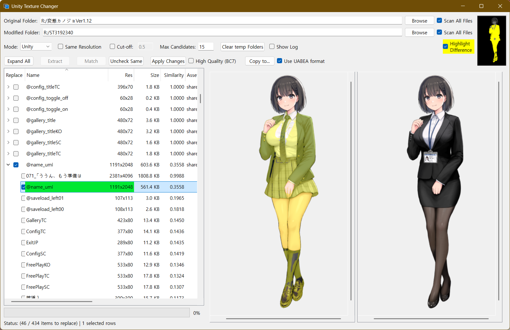

[English](./README.md) | [한국어](./README_ko.md)

# Unity Texture Changer



A sophisticated GUI tool designed to intelligently compare and replace textures within Unity assets, APK files, or standard image folders. It leverages Perceptual Hashing and Structural Similarity algorithms to automate the matching process between original and modified versions.

## Key Features

- **Multiple Mode Support**:
  - **Unity**: Directly extract and replace textures from installed Unity game folders.
  - **Unity APK**: Decompile APKs, modify textures, and perform repackaging/signing.
  - **Image**: Support for 1:1 file matching and overwriting between standard image folders.
- **Intelligent Matching**:
  - Fast candidate search using Hamming Distance.
  - Precision similarity analysis based on MSE (Mean Squared Error).
  - Name-based matching (logic to ignore Unity's `_PathID` suffixes) and resolution filtering.
- **Advanced Viewer**:
  - Synchronized scrolling and zooming for side-by-side comparison.
  - Difference Highlight feature to detect subtle pixel changes.
- **Unity Engine Optimizations**:
  - Manual decoding for non-standard headers (e.g., Unity 2021.3.45).
  - Automatic patching of Addressables `catalog.json` (CRC/Size/MD5) to prevent game freezes.
  - Support for high-quality BC7 compression forcing.

## Requirements
- You may need a lot of storage for your studies involving the extraction of asset files.

### Prerequisites
- Python 3.10+
- **(For APK Mode)** Java Runtime Environment (JRE) or JDK installed and added to PATH.

### Library Installation
```bash
pip install PyQt6 UnityPy Pillow opencv-python numpy packaging
```

### Additional Files
- To use the APK repacking feature, download `uber-apk-signer.jar` from [uber-apk-signer (GitHub)](https://github.com/patrickfav/uber-apk-signer) and place it in the same directory as the executable or `main.py`.

## Usage

1. **Set Paths**: Enter the path to the original game/images in 'Original Folder' and your modified images in 'Modified Folder'. (Supports Drag & Drop)
2. **Select Mode**: Choose the appropriate mode (Unity, APK, or Image).
3. **Extract**: For Unity/APK modes, extract textures from the assets. Previous sessions will be auto-loaded if available.
4. **Match**: Click 'Match' to automatically find the best candidates based on visual similarity.
5. **Review**: Select items in the list to compare them side-by-side and confirm the replacement candidates.
6. **Apply**: Click 'Apply Changes' to patch the assets or overwrite original files. (APK mode generates a new signed APK).

## Building the Executable

You can create a standalone `.exe` using the provided build script:

```bash
python build_exe.py
```
The output will be located in the `dist` folder.

## UI Overview

### 1. File & Directory Selection
*   **Original Folder**: The directory path containing the original game files or Unity assets.
*   **Modified Folder**: The directory path containing your edited or modified textures that you want to replace the originals with.
*   **Browse (Buttons)**: Opens a file explorer window to let you select the respective folders.
*   **Scan All Files (Checkboxes)**: When checked, the application will search for files recursively through all subdirectories within the selected folders.

### 2. Matching Settings & Options
*   **Mode (Dropdown)**: Selects the operation mode depending on the target format (e.g., Unity project, APK, standard images).
*   **Same Resolution**: If checked, the tool will only suggest modified textures that have the exact same resolution as the original texture.
*   **Cut-off**: The minimum similarity threshold (currently 0.5). The tool will ignore potential matches that have a similarity score lower than this value.
*   **Max Candidates**: Limits the maximum number of potential matching images shown for each original texture (currently set to 15).
*   **Clear temp Folders**: Deletes temporary files generated by the application during extraction or processing.
*   **Show Log**: Toggles a console window displaying detailed process logs and errors.

### 3. Action Buttons
*   **Expand All**: Expands all the collapsed folders or nested items in the left-hand list view.
*   **Extract**: Extracts accessible textures from the Unity assets located in the "Original Folder".
*   **Match**: Compares the extracted original textures with the images in the "Modified Folder" and pairs them up based on visual similarity.
*   **Uncheck Same**: Automatically deselects items in the list where the original and modified textures are identical (meaning no replacement is necessary).
*   **Apply Changes**: Executes the actual texture replacement, packing the selected modified textures back into the game files.
*   **High Quality (BC7)**: Forces the tool to use BC7 compression when packing textures, offering higher quality.
*   **Copy to...**: Allows you to save or export the newly modified game files to a specific destination folder instead of overwriting the originals directly.
*   **Use UABEA format**: Tells the tool to utilize the UABEA (Unity Asset Bundle Extractor Avalon) logic/format for processing the assets.

### 4. UI Elements & Previews
*   **Highlight Difference**: A toggle (highlighted in yellow when active) that visually highlights the differences between the original and the modified texture in the preview panels.
*   **Left Panel (List View)**: A detailed list showing the original textures, their matched candidates, resolution, file size, and similarity score. The checkboxes let you choose which files to actually replace.
*   **Center Preview Panel**: Displays the currently selected original texture.
*   **Right Preview Panel**: Displays the modified texture that is selected as a candidate to replace the original.
*   **Status Bar (Bottom)**: Shows the current state of the application, such as how many items are queued for replacement out of the total, and how many rows are currently selected.

## Hotkeys & Controls

### List (Results)
- **`Space`**: Toggle the 'Replace' checkbox for selected items. (Always checks sub-items).
- **`Delete`**: Remove selected original or candidate items from the list.
- **`+` (or `=`)**: Check all items for replacement.
- **`-`**: Uncheck all items.
- **`*` (Asterisk)**: Inverse all selection states.

### Comparison Viewer
- **`Mouse Wheel`**: Zoom in/out relative to the mouse pointer.
- **`Left Drag`**: Pan/Scroll images.
- **`Top Right Thumbnail Click`**: Jump to the clicked position on the texture.

### Paths
- **`Double Click`**: Open folder selection dialog.
- **`Drag & Drop`**: Drop folders or APK files directly onto the input fields.

## Important Notes

- **Backup**: 'Apply Changes' modifies original files. Always create a backup before proceeding.
- **APK Signing**: Modded APKs are signed with a debug key. You may need to uninstall the original app before installing the modded version.

## License
This tool is for personal use and utilizes the `UnityPy` library for asset manipulation.